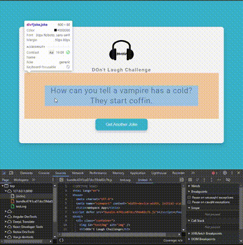

# 📦 Webpack & Alternatives

<h1 align="center">
  
</h1>

## What is Webpack? 🤔

**Webpack** is a powerful and flexible module bundler that lets you manage and bundle your JavaScript, CSS, images, and more into one or several optimized files for faster loading in the browser.

### 🔑 Key Features:

- **Entry Point**: Define where your app starts (`index.js`).
- **Output**: Specify where the bundled files should go.
- **Loaders**: Handle non-JS files like CSS, images, or even TypeScript.
- **Plugins**: Supercharge your build process by adding extra functionality (e.g., minification, caching).
- **Code Splitting**: Split your code into smaller chunks, loading only what's needed for faster page loads.

### Why Use Webpack? 💡

Webpack is highly customizable and is the go-to solution for large-scale web apps. But it’s also **not the only choice** out there!

---

## ⚡ Alternatives to Webpack

### 1. [Parcel](https://parceljs.org/) 🚀

Parcel is a zero-config bundler that's **fast** and **easy to use**. It automatically detects what to bundle based on the files you import, so you can get started with almost no setup.

- **Pros**:
  - No config required!
  - Super fast builds.
- **Cons**:
  - Less flexible for large, complex projects.

### 2. [Rollup](https://rollupjs.org/) 📦

Rollup is optimized for **bundling libraries** or packages that will be distributed as JavaScript modules. It’s famous for its **tree-shaking** feature, which eliminates unused code.

- **Pros**:
  - Smaller output files.
  - Perfect for libraries.
- **Cons**:
  - Not as suitable for full-fledged web apps.

### 3. [Vite](https://vitejs.dev/) ⚡

Vite is a modern build tool that brings **blazing-fast development** thanks to native **ESM** support and minimal bundling overhead. Vite is perfect for frameworks like Vue.js and React.

- **Pros**:
  - Lightning-fast builds, especially in development.
  - Seamless integration with modern frameworks.
- **Cons**:
  - Fewer ecosystem tools and plugins compared to Webpack (but it’s growing!).

### 4. [Snowpack](https://www.snowpack.dev/) ❄️

Snowpack skips the bundling process during development, loading files directly via **ES modules**. This means super fast iteration times, as there's no need to rebuild everything after each change.

- **Pros**:
  - Extremely fast during development.
- **Cons**:
  - Smaller community and fewer integrations compared to Webpack.

---

## Conclusion 🏁

Choosing the right bundler depends on your project needs. If you want **ease of use** and **speed**, give **Vite** or **Parcel** a shot! If you're working on a **larger, more complex app**, Webpack remains a solid, flexible choice with a vast ecosystem.

**Happy Bundling!** 🎉
